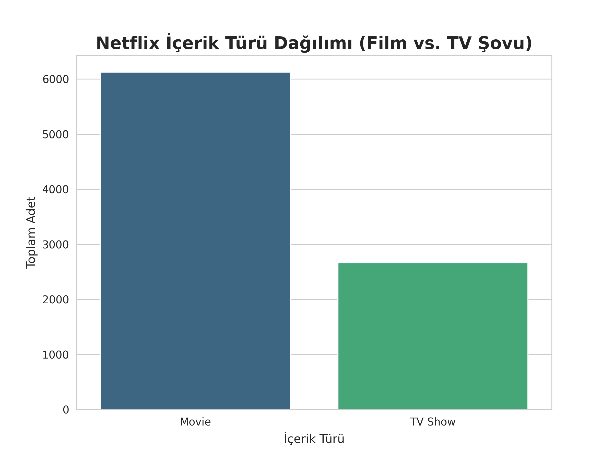
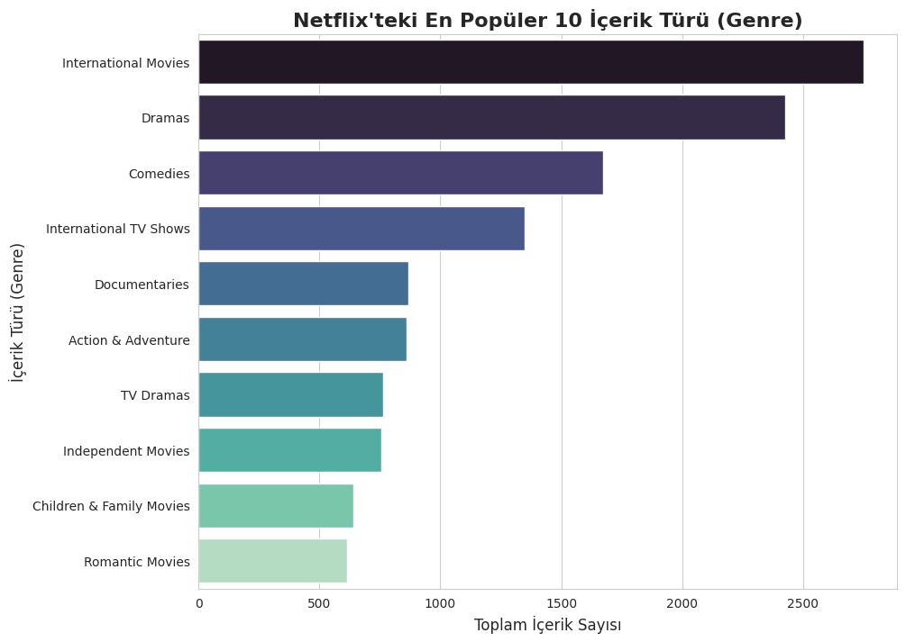

# Netflix İçerik Kütüphanesi: Keşifsel Veri Analizi (EDA)

Bu proje, popüler streaming platformu Netflix'in içerik kütüphanesini (filmler ve TV şovları) incelemek amacıyla gerçekleştirilmiş bir Keşifsel Veri Analizi (EDA) çalışmasıdır. Projenin amacı, kütüphanenin yapısını anlamak, içerik trendlerini belirlemek ve platformun stratejisi hakkında içgörüler (insights) elde etmektir.

**Veri Seti:** [Kaggle - Netflix Movies and TV Shows](https://www.kaggle.com/datasets/shivamb/netflix-shows)
**Kullanılan Araçlar:** Python, Pandas, Matplotlib, Seaborn, Google Colab

---

## Proje Adımları

Bu analiz 4 adımdan oluşmuştur:

1.  **Veri Yükleme ve İlk Bakış:** Veri seti yüklendi ve genel yapı incelendi.
2.  **Veri Temizleme ve Hazırlama:**
    * `director`, `cast`, `country` sütunlarındaki **eksik veriler (NaN)** "Bilinmiyor" olarak yeniden kategorize edildi.
    * `date_added`, `rating` gibi sütunlardaki az sayıda eksik veri içeren satırlar silindi (`dropna`).
    * `listed_in` (tür) sütunundaki "Dramas, International Movies" gibi **bileşik veriler**, her bir türü tek bir satıra getirmek için `split` ve `explode` yöntemleriyle parçalandı.
3.  **Analiz ve Görselleştirme:** Temizlenen veri üzerinden temel analiz soruları soruldu ve görselleştirildi.
4.  **Bulgu ve Yorumlama:** Grafiklerden elde edilen sonuçlar yorumlanarak stratejik içgörülere dönüştürüldü.

---

## Analiz Bulguları (Insights)

Proje sonucunda 3 temel bulguya ulaşılmıştır:

### Bulgu 1: Kütüphane Yapısı - Film Ağırlıklı Strateji

Analiz, Netflix kütüphanesinin içerik türü bakımından filmlerin belirgin bir şekilde hakimiyetinde olduğunu göstermektedir. Platformdaki **her 3 içerikten yaklaşık 2'si (%69) filmdir.** Bu durum, Netflix'in abone bağlılığı yaratan dizilerin yanı sıra, kataloğunun genişliğini büyük ölçüde filmlerle sağladığını göstermektedir.

### Bulgu 2: İçerik Odağı - "Uluslararası" ve "Mega-Türler"

En popüler 10 içerik türü (genre) incelendiğinde, 1. sırada "International Movies" ve 4. sırada "International TV Shows" kategorilerinin yer alması, Netflix'in **küresel bir pazar için aktif içerik üreten "Uluslararası" odaklı** bir strateji izlediğini net bir şekilde ortaya koymaktadır.

* **Not:** Listenin 2. sırasındaki "Dramas" gibi geniş mega-türler ile "Romantic Movies" gibi spesifik alt-türleri doğrudan kıyaslamak yanıltıcı olabilir. Aradaki sayısal fark, talepten çok kategorizasyon hiyerarşisinden kaynaklanmaktadır.

### Bulgu 3: Büyüme Trendi - Zirve ve Pandemi Etkisi

Platforma eklenen içerik sayısı yıllara göre incelendiğinde, 2015-2019 arası "hiper-büyüme" dönemi yaşandığı görülmektedir. 2015'ten 2017'ye **yaklaşık 16 katlık** bir hacim artışı yaşanmıştır.

Bu agresif büyüme 2019'da (~2000 içerik) zirveye ulaşmış, ancak Covid-19 pandemisinin neden olduğu **prodüksiyon problemleri** ve gecikmeli üretim nedeniyle 2021'e gelindiğinde, platforma eklenen içerik hacminde zirveye kıyasla **yaklaşık %25'lik bir düşüş** yaşanmıştır.

